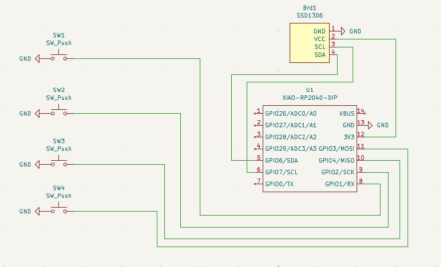
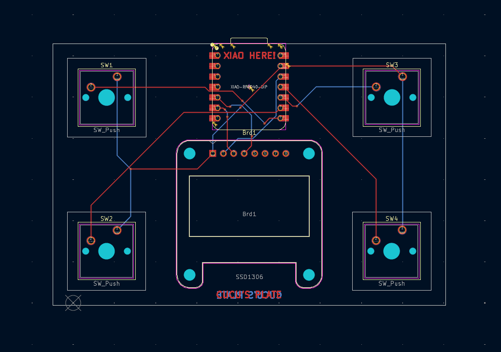
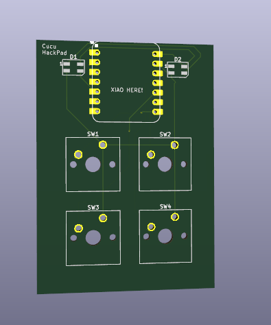
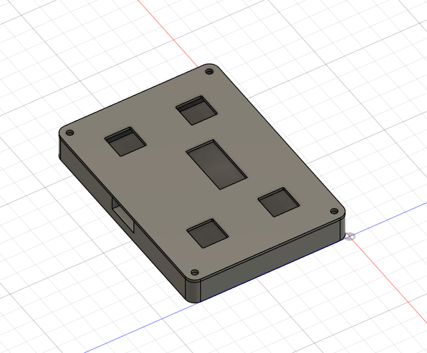

# Cucu's HackPad Project

## 1. Introduction
This is my first project and it's a hackpad designed to enhance my skills, not only in design but also in manual dexterity.
It includes the electrical schematic, PCB layout, and the 3D printed case for assembly.

### Overview

---

## 2. Schematic Part
The electrical schematic was designed in KiCad and shows all connections between components.
Thanks to the tutorial I gained the knowledge to design this scheme.
It clearly illustrates how the microcontroller, switches, and other peripherals are connected.

### Scheme

---

## 3. PCB Layout Part
The PCB layout optimizes space and minimizes interference.  
It includes clean routing and logical component placement.

### Layout

### 3D Layout

---

## 4. Case and Assembly part
The case is designed to fit the PCB and components perfectly.  
It ensures everything is protected and accessible for assembly.

### Screenshot

---

## 5. BOM

| Qty | Part | Extra Info |
|-----|------|
| 1   | Case Print |
| 1   | Seeed XIAO RP2040 |
| 4   | MX-Style Switches |
| 4   | Blank DSA Keycaps |
| 8   | M3x16mm Screws |
| 8   | M3x5mm x 4mm Heatset Inserts |
| 1   | SSD1306 |USEFUL LINK: https://es.aliexpress.com/item/1005006365845676.html?src=google&pdp_npi=4%40dis!EUR!3.85!1.73!!!!!%40!12000036911966888!ppc!!!&snps=y&snpsid=1&src=google&albch=shopping&acnt=752-015-9270&isdl=y&slnk=&plac=&mtctp=&albbt=Google_7_shopping&aff_platform=google&aff_short_key=_oDeeeiG&gclsrc=aw.ds&&albagn=888888&&ds_e_adid=775528715976&ds_e_matchtype=search&ds_e_device=c&ds_e_network=g&ds_e_product_group_id=2442123902571&ds_e_product_id=es1005006365845676&ds_e_product_merchant_id=5551326180&ds_e_product_country=ES&ds_e_product_language=es&ds_e_product_channel=online&ds_e_product_store_id=&ds_url_v=2&albcp=23045037975&albag=188614690969&isSmbAutoCall=false&needSmbHouyi=false&gad_source=1&gad_campaignid=23045037975&gbraid=0AAAAA_eFwRCxzE6aWxNVXiDaQlUcyDxgR&gclid=CjwKCAiAmKnKBhBrEiwAaqAnZ1PhuhTGql0nm-ejxXr3BOCzYExN2utP_V9kxMNPXnzlT2E30dIvohoCItQQAvD_BwE#nav-specification|